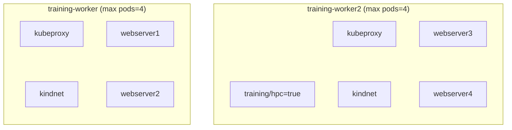

# Contested Scheduling Lab

This lab will setup a 2 node cluster and be setup to run at capacity (kubelet is fixed to 4 pods per node)



## Setup

```bash
make clean cluster
kubectl apply -f manifests/contested-scheduling.yaml
```

## Challenge

The goal is to apply the new "hpc" deployment, and convince the scheduler the following:

* To run on the HPC labelled node
* To evict the existing workloads from the node

```bash
kubectl apply -f manifests/hpc-api.yaml
```